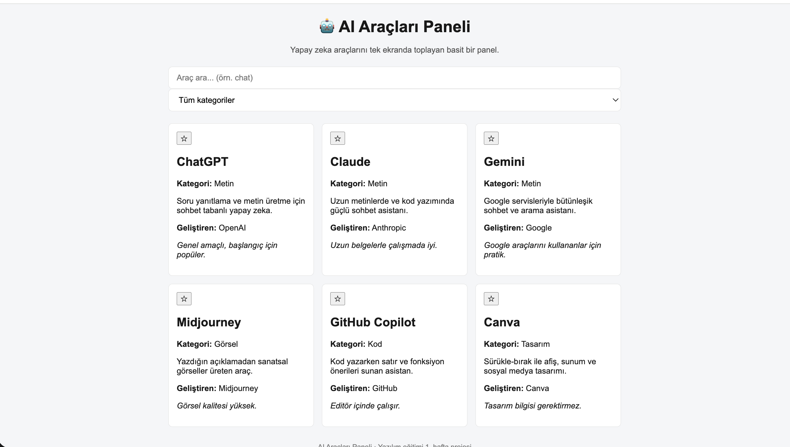

# 🤖 AI Araçları Paneli

Yapay zeka araçlarını (ChatGPT, Claude, Gemini, Midjourney, GitHub Copilot,
Canva...) tek ekranda listeleyen basit bir web paneli. Kullanıcı araçları
kart olarak görür, arayabilir, kategoriye göre süzebilir, favorilere ekleyebilir,
düzenleyebilir/silebilir, silinenleri geri yükleyebilir ve açık/koyu tema
arasında geçiş yapabilir.

Saf **HTML + CSS + JavaScript** ile yazılmıştır; hiçbir kütüphane/paket
gerektirmez. Yazılım eğitimi 1. hafta projesi.

## 🔗 Canlı demo

**[https://enesbilen12.github.io/enes-ai-tools-dashboard-week1](https://enesbilen12.github.io/enes-ai-tools-dashboard-week1)**

## 📸 Ekran görüntüsü

## 🎯 2. Hafta Hedefleri

Bu hafta panele eklemeyi planladığım özellikler:

- [ ] **`data.json` ile `fetch`** — başlangıç araç verisini koddan ayırıp
  `data.json` dosyasından `fetch` ile yükleme (fetch başarısızsa gömülü yedek liste).
- [ ] **Inline form validation** — `alert()` yerine form içinde kırmızı hata satırı.
- [ ] **JSON export özelliği** — mevcut araç listesini `.json` olarak dışa aktarma.
- [ ] **README ve test checklist güncelleme** — belgeleri 2. haftaya taşıma.

## ✨ Özellikler

- **Veriden kart üretimi** — Araçlar JavaScript'teki bir listeden okunur ve
  otomatik olarak kart halinde çizilir.
- **Arama** — İsim, kategori ve açıklama içinde canlı arama (yazdıkça süzülür).
- **Kategori filtresi** — Açılır menüden kategoriye göre filtreleme.
- **Favoriler** — Yıldıza tıklayarak favori ekle/çıkar; favoriler
  `localStorage`'da saklanır, sayfa yenilenince korunur.
- **Düzenle / Sil** — Her kart, kart içi formla düzenlenebilir veya silinebilir;
  değişiklikler `localStorage`'da kalıcıdır. Girilen metin güvenli biçimde
  işlenir (XSS'e karşı kaçış uygulanır).
- **Silinen araçlar menüsü** — Silinen araçlar sağ üstteki panele taşınır;
  tıklanınca ana panele geri yüklenir. Bu liste de kalıcıdır.
- **Açık / koyu tema** — Tek tıkla tema değişir; tercih `localStorage`'da saklanır.
- **Boş sonuç mesajı** — Arama/filtre bir şey bulamazsa "Araç bulunamadı" gösterilir.
- **Responsive tasarım** — Grid düzeni; masaüstünde yan yana, telefonda alt alta.
- **Erişilebilir arama kutusu** — Hover ve focus durumları için görsel geri bildirim.
- **Dayanıklılık** — Bozuk veya erişilemez `localStorage` durumunda uygulama
  çökmez, güvenli varsayılanlara döner.

## 🚀 Nasıl çalıştırılır?

Kurulum gerektirmez. İki yol var:

**1) Hızlı yol — çift tıklama**
1. `index.html` dosyasına çift tıkla; varsayılan tarayıcında açılır.

> ⚠️ **Uyarı:** Bu yöntemde sayfa `file://` adresinden açılır. Bazı tarayıcılar
> `file://` kökeninde `localStorage`'ı kısıtladığı için **favoriler
> kaydolmayabilir veya sayfa yenilenince kaybolabilir.** Favori özelliğini
> tam kullanmak için aşağıdaki Live Server yöntemini tercih et.

**2) Önerilen yol — Live Server (VS Code)**
1. VS Code'da **Live Server** eklentisini kur.
2. `index.html`'i aç → sağ alttaki **"Go Live"** butonuna tıkla.
3. Sayfa `http://127.0.0.1:5500/...` adresinden açılır.

> 💡 Live Server önerilir: sayfayı `file://` yerine `http://` üzerinden servis
> ettiği için tarayıcı güvenlik uyarıları çıkmaz, **favoriler güvenilir şekilde
> saklanır** ve dosyayı kaydettikçe sayfa otomatik yenilenir.

## 📂 Dosyalar

| Dosya | Görevi |
|-------|--------|
| `index.html` | Sayfanın iskeleti (yapı) |
| `style.css` | Görünüm (tema değişkenleri, grid, kartlar, formlar, menüler) |
| `app.js` | Davranış (veri, kart çizimi, arama, filtre, favoriler, düzenle/sil, silinenler, tema) |
| `README.md` | Bu tanıtım dosyası |
| `LICENSE` | MIT lisans metni |
| `.gitignore` | Git'in yok sayacağı dosyalar (`.DS_Store`) |

## ✅ Tamamlananlar

- [x] Temel iskeleti kur (HTML + CSS + JS)
- [x] Responsive grid düzeni
- [x] Araçları veriden kart olarak çiz
- [x] İsim + kategori + açıklama araması
- [x] Kategori filtresi
- [x] localStorage ile kalıcı favoriler
- [x] Boş sonuç için "Araç bulunamadı" mesajı
- [x] Açık / koyu tema (localStorage'da saklanır)
- [x] Araç düzenleme ve silme (kalıcı, XSS-güvenli)
- [x] Silinen araçlar menüsü ve geri yükleme

## 🔭 İleride (fikirler)

- [ ] "Sadece favorileri göster" filtresi
- [ ] Her kartı aracın web sitesine götüren bağlantı
- [ ] Panel dışına tıklayınca "Silinen Araçlar" menüsünü kapatma
- [ ] Basit birim testleri (örn. filtre mantığı)

## 🎓 Bu hafta öğrendiklerim

Bu projeyi geliştirirken pratikte öğrendiğim konular:

### HTML
- **Semantik etiketler** — `<header>`, `<main>`, `<section>`, `<footer>` ile
  anlamlı sayfa yapısı (erişilebilirlik ve SEO için `
` yığınından daha iyi).
- **CSS ve JS bağlama** — `<link>` ile stil, sayfa sonunda `<script>` ile davranış.
- **`
` vs semantik etiket** — `
` yalnızca anlamsal karşılığı olmayan
  gruplamalar için; mümkün olduğunda semantik etiket tercih edilir.

### CSS
- **Grid düzeni** — `grid-template-columns: repeat(auto-fit, minmax(...))` ile
  otomatik kart dizilimi.
- **Responsive tasarım & media query** — `@media (max-width: ...)` ile dar
  ekranda düzeni uyarlama.
- **Hover / focus** — kullanıcı etkileşimine görsel geri bildirim (`:hover`, `:focus`).
- **Karanlık / açık tema** — CSS değişkenleri (`:root`, `var(--...)`) ve
  `[data-theme="dark"]` ile tek noktadan tema yönetimi.

### JavaScript
- **Array & object** — veriyi nesnelerden oluşan bir dizide tutma.
- **DOM** — `querySelector`, `createElement`, `innerHTML`, `appendChild` ile
  sayfayı JavaScript'ten değiştirme.
- **`renderTools` / `kartOlustur` fonksiyonları** — veriyi ekrana çizme;
  sorumlulukları küçük fonksiyonlara ayırma.
- **Event listener & olay delegasyonu** — `addEventListener`; tek dinleyiciyle
  çok sayıda butonu yönetme.
- **localStorage** — favorileri, temayı, araç ve silinen listelerini kalıcı
  saklama (`getItem` / `setItem`, `JSON.parse` / `JSON.stringify`).
- **try/catch** — bozuk veya erişilemez `localStorage` durumunda çökmeyi önleme.
- **Form validasyonu** — `submit` olayında zorunlu alan kontrolü ve `preventDefault`.

### Git & GitHub
- **add / commit / push döngüsü** — değişiklikleri sahneleme, kaydetme, yayınlama.
- **Anlamlı commit mesajları** — `feat` / `fix` / `docs` / `style` / `chore` /
  `refactor` ön ekleri; mesajın içeriği dürüstçe yansıtması.
- **GitHub Pages** — projeyi ücretsiz canlı bir adreste yayınlama.
- **Branch (dal)** — `main` dalı ve dalların ne işe yaradığı.

### Genel
- **Claude Code ile çalışma** — bir yapay zeka asistanıyla adım adım geliştirme.
- **Prompt engineering** — istediğimi net, sınırlı ve adım adım anlatmanın
  daha iyi sonuç verdiğini görme.
- **AI ile kod incelemesi** — mentor gözüyle hata, okunabilirlik ve güvenlik
  geri bildirimi alma.
- **DevTools** — `F12` ile Console (hata/`console.log`) ve Application
  (localStorage) sekmelerini kullanma.

## 🧪 Test Notları

Proje geliştirilirken manuel olarak test edilen özellikler ve karşılaşılan
sorunlar aşağıda özetlenmiştir.

### Test edilen özellikler

- [x] **Arama** — isim, kategori ve açıklama içinde canlı arama
- [x] **Kategori filtresi** — açılır menüden kategoriye göre süzme
- [x] **Arama + kategori birlikte** — iki filtrenin aynı anda uygulanması
- [x] **Favoriler** — yıldızla ekleme/çıkarma ve kalıcılık
- [x] **Mobil / responsive görünüm** — dar ekranda kartların alt alta dizilmesi
- [x] **Boş sonuç mesajı** — eşleşme yoksa "Araç bulunamadı" gösterimi
- [x] **localStorage kalıcılığı** — sayfa yenilenince verilerin korunması
- [x] **"Siteye Git" butonu** — URL'li kartlarda yeni sekmede site açma
- [x] **Araç ekleme / silme / düzenleme** — tam CRUD akışı
- [x] **Silinen araçlar menüsü** — silinenleri geri yükleme
- [x] **Karanlık / açık tema** — tema geçişi ve tercihin saklanması
- [x] **Özet kutuları** — toplam ve favori araç sayısının otomatik güncellenmesi

### Bulunan hatalar ve çözümleri

| # | Sorun | Çözüm |
|---|-------|-------|
| 1 | `file://` ile açınca `localStorage` kısıtlanıyor, favoriler kaydolmuyordu | **Live Server** ile `http://` üzerinden çalıştırılarak çözüldü |
| 2 | macOS'un `.DS_Store` sistem dosyası yanlışlıkla repoya eklendi | **`.gitignore`** eklenip dosya takipten çıkarılarak çözüldü |
| 3 | GitHub Pages deploy adımı başarısız oldu ("Deployment failed") | Deploy **yeniden tetiklenerek / ayar yenilenerek** çözüldü |

### Bilinen kısıt

- **`localStorage` cihaza ve tarayıcıya özeldir.** Bir cihazda eklenen araçlar
  başka bir cihazda veya başka bir tarayıcıda görünmez. Herkesin aynı veriyi
  görmesi için sunucu tabanlı bir veritabanı gerekir (bu projenin kapsamı dışında).

## 📄 Lisans

Bu proje **MIT Lisansı** ile açık kaynaktır; herkes özgürce kullanabilir,
kopyalayabilir ve değiştirebilir. Tam yasal metin için proje kökündeki
[`LICENSE`](LICENSE) dosyasına bakabilirsin.
